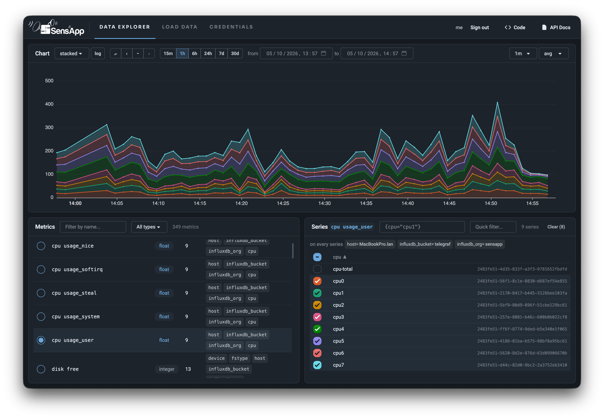

# 

SensApp is an open-source sensor data platform developed by [SINTEF](https://www.sintef.no/).

It handles time-series data ingestion, storage, and retrieval. From small edge devices to big data digital twins, SensApp *may* be useful.

## SensApp Allows You to Process Years of Sensor Data Efficiently

SensApp is compatible with Prometheus and InfluxDB, but with an alternative architecture that prioritise data analysis and long-term storage over ingestion performance and real-time monitoring.

Dealing with system statistics for the last 24 hours? InfluxDB or Prometheus are excellent choices. Fetching average bathroom temperatures over the last 10 years grouped by day? SensApp will compute that instantly while InfluxDB or Prometheus will take a little while.

But you don't have to chose, both InfluxDB and Prometheus can replicate their data to SensApp for long-term storage and analysis. So you can get the best of both worlds.

You can also use SensApp as a standalone time-series database. It's designed to work from the edge to the big data workloads in the cloud, by relying on different databases.



## Quickstart

The simplest way to test SensApp is using it with SQLite and no authentication:

```bash
export SENSAPP_STORAGE_CONNECTION_STRING=sqlite://sensapp.db
export SENSAPP_AUTH_DISABLED=true
cargo run --release
```

By default, SensApp listens on [http://127.0.0.1:3000](http://127.0.0.1:3000) for both its API and user interface.

Ingest one sample:

```bash
curl --json '[{"n": "temperature", "v": 21.5}]' \
  http://127.0.0.1:3000/publish
```

Query the stored data:

```bash
curl 'http://127.0.0.1:3000/api/v1/query?query=temperature'
# or
curl 'http://127.0.0.1:3000/api/v1/query?query=temperature&format=csv'
```

## Python Quickstart

Check the [python/sensapp](./python/sensapp) documentation or the [python quickstart notebook](./python/quickstart.ipynb) for more details.

```python
import asyncio
from sensapp import SensAppClient

async def main():
    async with SensAppClient() as client:
        await client.publish("temperature", 21.5)
  [series] = await client.query("temperature[1h]")
  print(series.frame)

asyncio.run(main())
```

## Software Containers and Kubernetes

```bash
docker compose up
```

You can deploy SensApp on Kubernetes using [the included Helm chart](./charts/sensapp/README.md). It defaults to SQLite on an ephemeral volume, or can connect to an external PostgreSQL, TimescaleDB, or ClickHouse database.

```bash
helm install sensapp ./charts/sensapp
```

Published releases also provide the chart through GHCR as an OCI package; see the chart README for the versioned install command.

## Features

- **HTTP REST API**
- **Graphical User Interface**
- **Prometheus Compatibility**
  - **Prometheus Remote Write**: Prometheus can push data to SensApp.
  - **Prometheus Remote Read**: Prometheus can also read data from SensApp.
  - **Prometheus Scrape Endpoint**: SensApp exposes internal service metrics on `/prometheus/metrics`.
- **InfluxDB Compatibility**:
  - **InfluxDB Line Protocol**: You can use SensApp instead of InfluxDB, with [Telegraf](https://github.com/influxdata/telegraf) for example.
  - **InfluxDB Data Replication**: InfluxDB [can replicate its data to SensApp](https://docs.influxdata.com/influxdb/cloud/write-data/replication/replicate-data/).
- **Data formats**:
  - **JSON**: Simple and widely used format for data interchange.
  - **CSV**: The classic.
  - **SenML**: Standardized format for sensor data representation, that is almost unheard of but actually pretty good.
  - **Apache Arrow IPC Support**: Efficient IPC format for high-performance data interchange.
- **Flexible Time Series Database Storage**:
  - **SQLite**: Lightweight embedded database for edge deployments.
  - **DuckDB**: Alternative to SQLite, potentially faster for analytical queries. *Not enabled by default*.
  - **PostgreSQL**: Robust relational database for medium to large deployments, with optional TimeScaleDB plugin for enhanced time-series capabilities.
  - **ClickHouse**: Columnar database management system for high-performance analytical queries on large volumes of data.
  - **BigQuery**: Fully-managed serverless data warehouse for scalable analysis. *Not enabled by default*.
  - **RRDCached**: Integration with RRDtools, mostly implemented for fun. *Not enabled by default*.

## Architecture

SensApp's architecture is relatively simple as the complex problems are delegated to existing databases. It's a stateless adapter between HTTP clients and the chosen time-series database(s).

Most of the complexity lies in the [database schema design](docs/DATAMODEL.md). After that, it's mostly some code glue.

- On the **edge**, SensApp can be deployed as a single instance with a SQLite database.
- For **medium** deployments, SensApp can be deployed with a PostgreSQL database.
- For **larger** deployments, many SensApp instances can be deployed behind a load balancer, connected to a ClickHouse database cluster. A message queue and some middleware can be considered to ingest data at scale.

SensApp storage is based on the findings of the paper [TSM-Bench: Benchmarking Time Series Database Systems for Monitoring Applications](https://dl.acm.org/doi/abs/10.14778/3611479.3611532). ClickHouse also released [an experimental time-series engine](https://clickhouse.com/docs/engines/table-engines/special/time_series) that is somewhat similar to SensApp's storage schema.

Check the [ARCHITECTURE.md](docs/ARCHITECTURE.md) file for more details.

## Authentication

SensApp uses JSON Web Tokens (JWT) for its authentication. Visit [docs/JWT_AUTH.md](./docs/JWT_AUTH.md) for the detailed authentication documentation.

While you can start sensapp with authentication disabled, it is recommended to use the authentication feature, in command line or through the web interface. By default, SensApp will print an admin token and a link that you can use to generate more tokens.

## Built With Rust™️

SensApp is developed using Rust, a language known for its performance, memory safety, and annoying borrow checker. SensApp used to be written in Scala, but the new authors prefers Rust.

Another reason is from the results from the paper [Energy efficiency across programming languages: how do energy, time, and memory relate?](https://dl.acm.org/doi/10.1145/3136014.3136031), which shows Rust as one of the most energy-efficient programming languages while having memory safety.

Not only the language, it's also the extensive high quality open-source ecosystem that makes Rust a great choice for SensApp.

*Here ends the mandatory Rust promotion paragraph.*

## Contributing

We appreciate your interest in contributing to SensApp! Contributing is as simple as submitting an issue or a merge/pull request. Please read the [CONTRIBUTING.md](CONTRIBUTING.md) file for more details.

## License

This project is licensed under the Apache License 2.0 - see the [LICENSE](LICENSE) file for details.

The SensApp software is provided "as is," with no warranties, and the creators of SensApp are not liable for any damages that may arise from its use.

## You May Not Want to Use It in Production (Yet)

SensApp is currently under development. It is getting ready for production.

## Acknowledgements

We thank [the historical authors of SensApp](https://github.com/SINTEF/sensapp/graphs/contributors) who created the first version a decade ago.

SensApp is developed by
[SINTEF](https://www.sintef.no) ([Digital division](https://www.sintef.no/en/digital/), [Sustainable Communication Technologies department](https://www.sintef.no/en/digital/departments-new/department-of-sustainable-communication-technologies/), [Smart Data research group](https://www.sintef.no/en/expertise/digital/sustainable-communication-technologies/smart-data/)).

It is made possible thanks to the research and development of many research projects, founded notably by the [European Commission](https://ec.europa.eu/programmes/horizon2020/en) and the [Norwegian Research Council](https://www.forskningsradet.no/en/).

We also thank the open-source community for all the tools they create and maintain that allow SensApp to exist.
