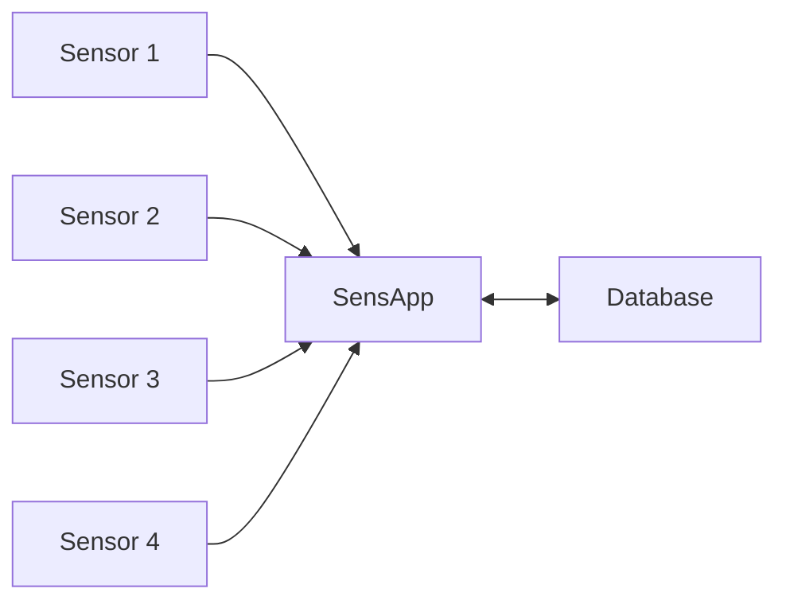
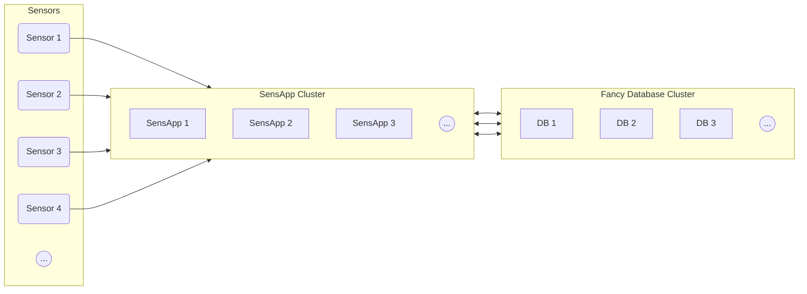

# SensApp Architecture

SensApp should be an accommodating platform to support sensor-based applications.

It should be relatively small and simple to transform incoming sensor data, persist it, and make it available to other applications.

## Simple SensApp Deployment Example

## Distributed SensApp Deployment Example

## Technology and programming language

Previously developed in Scala, we rewrote SensApp in Rust. The main reason is that the new author prefers Rust over Scala or Golang. The second main reason is from the results from the paper [Energy efficiency across programming languages: how do energy, time, and memory relate?](https://dl.acm.org/doi/10.1145/3136014.3136031), which shows Rust as one of the most energy-efficient programming languages while having memory safety.

SensApp uses the Rust Tokio runtime for asynchronous programming.

## Internal Architecture

SensApp is designed to be stateless and horizontally scalable. It uses direct storage calls rather than internal message buses to minimize complexity and maximize performance.

## Incoming data streams

SensApp focuses on HTTP-based data ingestion:

- HTTP REST Push (primary ingestion method)
- InfluxDB Write API
- Prometheus Remote Write API

For message queue protocols (MQTT, AMQP, Kafka, Nats), we recommend using dedicated integration tools like Telegraf, Vector, or Fluent Bit to bridge these protocols to SensApp's HTTP API. This architectural decision keeps SensApp stateless and horizontally scalable, as the complexity of maintaining message queue client connections and subscriptions is better handled by specialized tools.

## Supported incoming data formats

Sensor data can come in many formats, and as an accommodating platform, SensApp should support the most common ones.

CSV, JSON, SenML, and Parquet are supported. But more formats can be added whenever needed.

We also support InfluxDB line protocol, and the Prometheus remote stores protocol to allow an easy transition from these platforms to SensApp.

## Storage

SensApp should support various storage backends. The best storage backend for time series has yet to exist.

- For small deployments, SQLite is used.
- It is possible to use Litestream to replicate and backup the SQLite database.
- For medium deployments, PostgreSQL is used.
  - It is optional to use the TimescaleDB plugin or Citus Columnar.
- For larger deployments, ClickHouse is used.

- A experimental support for DuckDB is also available. The DuckDB database format isn't stable yet, and it may be wise to wait for the DuckDB 1.0 release before using it in production.

SensApp can use other storage backends in the future. Could it be Cassandra, Apache IoTDB, OpenTSDB, QuestDB, HoraeDB, or something new?

We base our storage on the findings of the paper [TSM-Bench: Benchmarking Time Series Database Systems for Monitoring Applications](https://dl.acm.org/doi/abs/10.14778/3611479.3611532) that shows that ClickHouse is a better choice than most databases for time series at scale, at the moment. Unfortunately, The paper didn't include IoTDB, and the new author doesn't like the JVM much, so IoTDB support is not a priority. Other databases are relatively new, and we favour the most popular ones for now.

SensApp also supports SQLite for small deployments and local persistence. The SQLite storage feature cannot scale to large deployments, but many deployments are small, and SQLite is a good choice for these. When combined with [Litestream](https://litestream.io/), SQLite can have some replication and backup capabilities.

PostgreSQL is also supported as it is the most popular database according to the [StackOverflow developer Survey 2023](https://survey.stackoverflow.co/2023/) and should provide a good compromise between performance and convenience. The choice between Vanilla PostgreSQL tables, TimeScaleDB bucketstyle (hyper) tables, or Citus columnar tables is left to the user.

Columnar storage with compression fits well with time series data, and a distributed Clickhouse cluster is the favoured choice for large deployments.

DuckDB is a new database that is promising. It can be seen as some kind of columnar SQLite, for analytics. Once the DuckDB 1.0 release is out, it may be a good choice for small to medium deployments.

SensApp used to rely on MongoDB, as it was created during the NoSQL hype, but the performances were very poor for this use case. It was supposed to web scale, but it didn't scale well enough for time series data. Having a binary JSON (BSON) document per datapoint had a too significant overhead.

## Scalability

SensApp should be able to scale vertically and horizontally. However, the burden of horizontal scaling is left to other components outside SensApp.

At scale, it is strongly advised to rely on the message queue ingestion pipelines when possible.

The publisher should have a mechanism to automatically retry when SensAPP returns a 503 HTTP error because of a high load.

SensApp should scale horizontally and not persist state on its own. It keeps relatively small buffers in memory to improve performances and relies on the storage backend to persist data. Publishers should consider the data as persisted once SensApp acknowledges it.

The storage layer should scale as well. SQLite on a network filesystem or using Litestream may, but using another distributed storage backend is advised when one single database instance isn't enough.

It is essential to mention that horizontal scalability comes with a higher complexity and energy cost. Prefer vertical scalability when possible. In 2024, single database servers can handle high loads, with hundreds of cores, petabytes of storage, and terabytes of RAM.

## Resilience

SensApp should acknowledge the persistence of the incoming data once the storage backend has persisted it. If SensApp crashes or is shut down, the publisher should keep the data and wait for SensApp to return online.

The publisher should favour the message queue ingestion pipeline if resilience is a concern.

The storage backend and the message queue should be resilient.

## Internal Software Architecture

Internally, SensApp uses direct storage calls for simplicity and performance. Components communicate through shared storage interfaces with async/await patterns.
