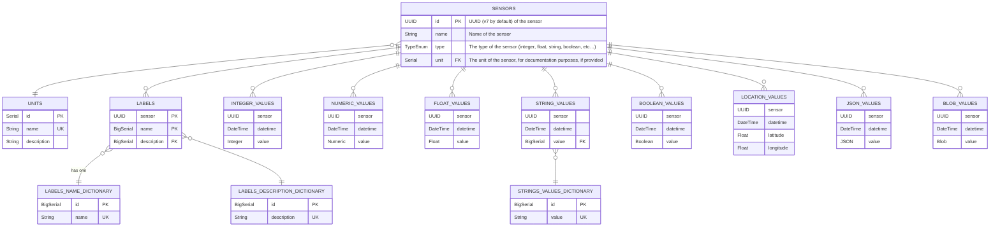

# SensApp Data Model

The SensAPP data model is inspired by the [SenML proposed standard](https://www.rfc-editor.org/rfc/rfc8428), the [Prometheus remote write](https://prometheus.io/docs/concepts/remote_write_spec/) and [remote read](https://github.com/prometheus/prometheus/blob/main/prompb/types.proto) data models, the [InfluxDB line protocol](https://docs.influxdata.com/influxdb/cloud/reference/syntax/line-protocol/), the [OpenMetrics](https://openmetrics.io) proposed standard, and [ThingModel](https://github.com/SINTEF-9012/ThingModel).

A sensor has a unique name used to identify it.

Each sensor contains only one type of data. If your sensor measures more than one thing, like temperature and humidity, it should be represented as two sensors in SensApp.

Sensors can have labels attached to them, which are key-value pairs. Those are not tracked over time. They are used to add metadata to the sensors. If you wish to track labels, you should create a sensor for each label and use the sensor value to store the label value.

SensApp distinguises between:

 - **Integer** values, which are 64 bits integers.
 - **Float** values, which are IEEE 754 64 bits floating point numbers. Those are **approximates** values, check the section about floating point numbers for more information.
 - **Numeric** values, which are decimal numbers, that shouldn't be approximate values. This is not supported by SQLite 3, it was during the SQLite4 experimental project, but is supported by PostGreSQL and ClickHouse.
 - **String** values, which are UTF-8 encoded strings.
 - **Boolean** values, which are true or false.
 - **Locations** values, which are latitude and longitude coordinates, with an optional altitude. We consider earth as the center of the universe. _Do not_ use this type for space projects, and rely on multiple sensors instead.
 - **JSON** values, which are JSON objects. This not a recommended type but it can be very convenient to store complex data.

## Virtual Composite Sensors

SensApp can compose sensors together. For example if you have a sensor that measures the temperature and another one that measures the humidity, you can create a virtual sensor that will consist of both the temperature and humidity sensors.

This can be useful to simplify the data model and the queries. Composite Sensors can also be represented as materialised views in the database, which can improve the read performances.

Virtual Sensors time-series data is joined through the timestamp, using a configurable window size. For example every second, minute, day… It is possible to have a composite sensor consisting of only one sensor to enable resampling.

## Optimisations and Compression

SensApp does not attempt to do optimisation and compression on the time series data itself. This is left to the storage backend. PostGreSQL with the TimeScaleDB extension, ClickHouse, or Parquet files will optimise and compress the data pretty well.

The SQLite storage backend will not compress the data or optimise it with advanced techniques like Gorilla.

## Identifiers

Identifiers should follow the UUID (Universal Unique Identifier) format, a 128bits number. It has a bit more overhead than the traditional 32 or 64 bits identifiers, but it is much more flexible and convenient.

The most common type of UUID is the version 4, which is generated randomly. If the random generator is cryptographically safe, this makes it difficult to predict the other identifiers, thus mitigating the security risks associated with sequential integers. In distributed systems, there is no need for a central server to generate identifiers. The system only needs to generate a very big (122-bit) random number. The probability of a collision, generating randomly the same identifier more than once, is extremely low and not a concern in practice. The oceans would likely boil before a collision happens.

However, most UUIDs cannot be sorted or indexed efficiently as related entries will have identifiers very far apart. Having entries created about the same time stored with similar identifiers can have benefits for SensApp. For example, if you want to retrieve the last 100 entries created, an index scan will be more efficient if the identifiers are close. Snowflake IDs, ULID, or UUID v7 are types of identifier that uses the current date first and some randomn bytes as well. It allows entries created about the same time to have identifiers close to each other while still being unique and difficult to predict. Snowflake also use the host name of the machine to avoid collisions, but using more random bits sounds like a better solution.

Using a timestamp inside the identifier does give away the creation time in the identifier, but this is not a concern for SensApp as the datetime is important to communicate anyway.

While [UUID v7](https://www.ietf.org/archive/id/draft-peabody-dispatch-new-uuid-format-04.html#name-uuid-version-7) is a slowly moving draft that is far from being standardised, SensApp should favour UUID v7 for its identifiers. SQlite, PostGreSQL, and ClickHouse do not validate UUIDs and accept 128 bits numbers formated as UUIDs but do not check the versions or the variants. This means that SensApp can use UUID v7 identifiers without any issue and switch to another type of identifier in the future if needed.

## IEEE 754 Floating Point Numbers

Numbers in SensApp are often represented as IEEE 754 floating point numbers. This is the standard representation of floating point numbers in most IT system.

[Quoting the SQLite documentation](https://sqlite.org/floatingpoint.html):

> **Floating point values are approximate.**
>
> …
>
> Surely that level of precision is sufficiant for most purposes?

There are high chances than your sensors will not be able to measure a value with a precision of 1e-15. If you need to store sensor data with such precision, do not store them as floating point numbers and make sure to not use floating point numbers in your data pipelines. For example the JSON format uses floating point numbers by default.

One safe solution is to store your values as strings. This is not going to be as efficient, but it should keep the precision along all your data pipelines.

## String Deduplication using Dictionaries

String values should be stored in a separate table to avoid duplication. When using SQLite and PostGreSQL, this is done using a dictionary table and manual code by SensApp. When using ClickHouse, this is done automatically by the database using the [`LowCardinality`](https://clickhouse.com/docs/en/sql-reference/data-types/lowcardinality) data type modifier.

Using a dictionary improves the performances in most cases. However if many strings are unique, the performances can be worse than using a regular string.

[The ClickHouse documentation](https://clickhouse.com/docs/en/sql-reference/data-types/lowcardinality) says the following:

> The efficiency of using LowCardinality data type depends on data diversity. If a dictionary contains less than 10,000 distinct values, then ClickHouse mostly shows higher efficiency of data reading and storing. If a dictionary contains more than 100,000 distinct values, then ClickHouse can perform worse in comparison with using ordinary data types.

In practice, we expect sensors to not generate unique distinct strings all the time, so using a dictionary should be a good idea for the majority of use cases.

## Geolocation and Coordinates Systems

In the current version, the geolocalised data doesn't really mind the coordinate system used. The data is likely going to use WGS84, but it could be ETRS89 or something else. It's up to the publisher and the consumer to agree on the coordinate system used, for now.

## TimeStamps are in microseconds

We use microsecond timestamps, as it provides a good compromise between precision and storage size. Some time-series database go down to nanoseconds but then the minimum and maximum timestamps are too close in times using 64 bits integers. It should be possible to have historical data and prediction data in SensApp. We haven't identified use cases that would require nanosecond precision in our research. People with such use cases should consider patching SensApp or using another solution.
